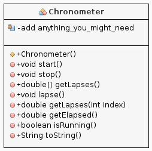

# Cronometro
Dato il seguente diagramma di classe:



implementare la classe Chronometer ed una classe che ne testi le funzionalità di base.

## Note
* la dicitura *anything you_might_need* significa che potete aggiungere gli attributi che ritenete opportuni per implementare la classe;
* per leggere il clock di sistema, potete usare il metodo ```System.nanotime()```;
* per il significato dei metodi, nel file [chronometer.zip](chronometer.zip) è riportata la documentazione in formato javadoc.

## WARNINGS
**NON** è consentito cambiare la firma dei metodi, e **nemmeno** il tipo restituito!!!